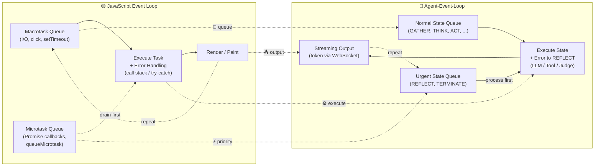
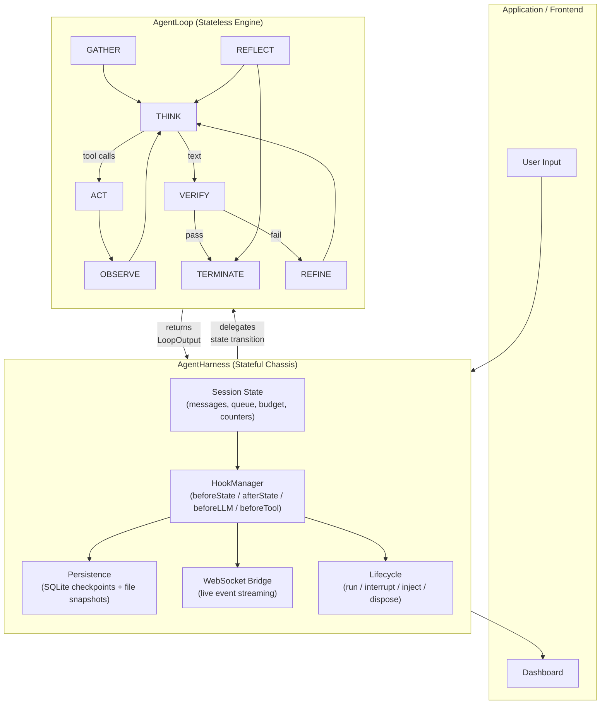
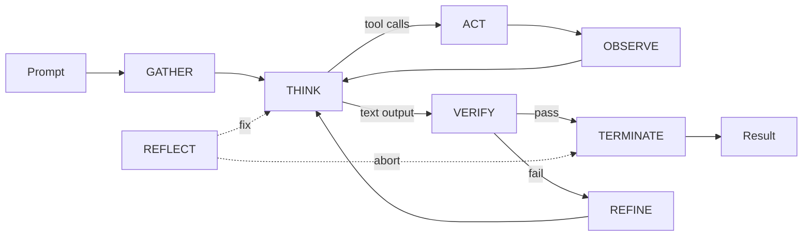

# Agent-Event-Loop

> **v3.0 — Stateless Engine + Stateful Chassis**  
> Decoupling the agent loop from the runtime harness.

[](https://bun.sh)
[](https://www.typescriptlang.org)
[](LICENSE)

---

[**简体中文**](./README.zh-CN.md) · [Design Document (EN)](./DESIGN.md) · [设计文档 (中文)](./Agent-Event-Loop%20设计文档.md)

---

## Overview

**Agent-Event-Loop** is an AI Agent orchestration framework inspired by the JavaScript Event Loop. It transforms the core ideas of Event Loop — **message queue**, **non-blocking I/O**, and **event-driven architecture** — into a scheduling system for **Agent cognition flows**.

### 🆕 v3.0: Two-Layer Architecture

Following the industry evolution pioneered by Claude Code, OpenCode, and OpenHarness, v3.0 decouples the runtime into **two distinct layers**:

| Layer | Stateless? | Responsibility |
|-------|-----------|----------------|
| **AgentLoop** | ✅ **Stateless engine** — zero mutable fields, pure transition functions | Think-act-observe state machine; calls LLM & tools; emits events |
| **AgentHarness** | ❌ **Stateful chassis** — owns all session state | Manages queue, messages, budget, persistence, lifecycle, hooks, observability |

| Concept | Agent-Event-Loop | Purpose |
|---|---|---|
| Message Queue | **State Queue** | Schedule cognitive states instead of events |
| Microtask Queue | **Priority Queue** | Urgent states (REFLECT/TERMINATE) are processed first |
| Event Handler | **State Executor** | Handle each cognitive state (THINK, ACT, VERIFY, ...) |
| Error Propagation | **Stateful Recovery** | Errors become REFLECT states instead of crashes |
| GC / Heap | **Session Store** | Persist conversation history and intermediate state |

### Event Loop vs Agent-Event-Loop

The diagram below maps each phase of the JavaScript Event Loop to its counterpart in the Agent-Event-Loop architecture. The two systems share the same message-driven, priority-queue pattern — adapted from browser events to cognitive states.



---

## Architecture

### Two-Layer System Design



**Data flow:**

1. **AgentHarness** receives user input → enqueues initial `GATHER` state
2. **AgentHarness** dequeues state, calls `hooks.beforeState()`, wraps LLM/tools with hooks
3. **AgentHarness** delegates to **AgentLoop.transition(LoopInput)** — pure computation
4. **AgentLoop** executes the state machine, calls LLM & tools, returns `LoopOutput`
5. **AgentHarness** applies `LoopOutput` to its session state, saves checkpoint, broadcasts via WebSocket
6. Loop repeats until budget exhausted or termination condition met

### State Machine Flow

The 8-state cognitive cycle:



Agent states cycle between **GATHER → THINK → ACT → OBSERVE → THINK → VERIFY → TERMINATE**, with **REFINE** and **REFLECT** providing self-correction loops. REFLECT can be injected at any point as an urgent state (dashed arrows).

---

## Features

| Feature | Description |
|---|---|
| **🧩 Stateless Loop + Stateful Harness** | `AgentLoop` = pure engine (zero mutable fields); `AgentHarness` = runtime chassis (session, lifecycle, infrastructure) |
| **🔄 8-State Cognitive Cycle** | `GATHER → THINK → ACT → OBSERVE → VERIFY (+ REFINE/REFLECT) → TERMINATE` |
| **⚡ Dual-Queue Scheduling** | Normal states + urgent queue (REFLECT, TERMINATE processed first) — inspired by Microtask/Macrotask |
| **📊 4D Budget Control** | maxTurns / maxTotalTokens / maxIterations / maxExecutionTime |
| **🩹 Self-Healing Errors** | Errors never crash the loop; they're converted to urgent REFLECT states for self-correction |
| **💾 Checkpoint + Snapshot** | SQLite checkpoints (every N turns) + file system snapshots (disaster recovery) |
| **🌐 WebSocket Observability** | Live event streaming via `ws://host:port/agent-ws?sessionId=xxx` — bidirectional INTERRUPT/INJECT commands |
| **🔌 Hook System** | `beforeState/afterState/beforeLLM/beforeTool/afterTool` — extensible via `AgentHook` interface |
| **🧩 Plugin LLM & Tools** | Swap between MockLLMProvider, OpenAIProvider, or custom providers |
| **⚡ Bun-Native Performance** | `bun:sqlite` (WAL), `Bun.write` (io_uring), `queueMicrotask`, `Bun.serve()` |
| **🧪 Isolatable Engine** | `AgentLoop` can be unit-tested independently with no infrastructure dependencies |

---

## Quick Start

### Install

```bash
curl -fsSL https://bun.sh/install | bash
git clone https://github.com/archerzing-tech/agent-event-loop.git
cd agent-event-loop
bun install
```

### Minimal Example (AgentHarness)

Use `AgentHarness` for the full agent experience — session management, persistence, hooks, WebSocket:

```typescript
import { AgentHarness } from 'agent-event-loop';

const agent = new AgentHarness({
  llm: { provider: 'openai', model: 'gpt-4o-mini', apiKey: process.env.OPENAI_API_KEY },
  tools: {
    search: async (query) => { /* search logic */ },
    calculator: async (expr) => { /* calculator logic */ },
  },
  budget: { maxTurns: 10, maxTotalTokens: 5000 },
});

const result = await agent.run("Search today's news and summarize into 3 points");
console.log(result.output);
```

### Minimal Example (AgentLoop — pure unit testing)

Use `AgentLoop` directly for isolated unit testing of the state engine:

```typescript
import { AgentLoop, type LoopInput } from 'agent-event-loop';
import { makeState } from 'agent-event-loop';

const loop = new AgentLoop();  // ⚡ zero mutable state — reusable across tests

const out = await loop.transition({
  state: makeState('THINK'),
  messages: [{ role: 'user', content: 'hello' }],
  tools: {},
  llm: mockLLM,               // inject your own mock
  refineAttempts: {},
  currentOutput: null,
  emit: (type, payload) => {}, // event spy
});

expect(out.nextStates[0].state.type).toBe('VERIFY');
```

The `AgentLoop` class has **zero fields** — you can instantiate it once and reuse across your entire test suite.

### Backward Compatibility

`AgentEventLoop` is still available as an alias for `AgentHarness`:

```typescript
import { AgentEventLoop } from 'agent-event-loop';
// Same API as before — unchanged
const agent = new AgentEventLoop({ /* ... */ });
```

### Run Demos

```bash
# Minimal verification (offline, no API key needed)
bun run demo

# Advanced: multi-tool orchestration, VERIFY→REFINE, REFLECT self-heal, budget exhaustion, hook interception
bun run demo:complex

# WebSocket bridge: in-process client subscribes to events, sends INTERRUPT
bun run demo:ws
```

### WebSocket Monitoring

```typescript
// Agent starts WebSocket bridge
const agent = new AgentHarness({ wsPort: 8080, /* ... */ });

// Client connects
const ws = new WebSocket('ws://localhost:8080/agent-ws?sessionId=demo');
ws.onmessage = (e) => {
  const evt = JSON.parse(e.data);
  console.log(`[${evt.type}]`, evt.payload);
};

// Send control commands from the frontend
ws.send(JSON.stringify({ type: 'INTERRUPT', kind: 'hard', reason: 'user-cancelled' }));
ws.send(JSON.stringify({ type: 'INJECT', message: 'Use a simpler style' }));
```

### Session Recovery

```typescript
// Reuse the same sessionId to recover from the last checkpoint
const agent = new AgentHarness(config, 'user-123-session');
await agent.run('Continue my previous task');
```

---

## Performance Benchmarks

Tested on Bun v1.3.0, MacBook Pro M2 Pro, 16GB RAM:

| Metric | Value |
|---|---|
| Per-turn latency (no tool calls) | ~1.2s |
| Per-turn latency (3 tool calls) | ~2.8s |
| Checkpoint write latency | ~1.2ms |
| WebSocket event broadcast latency | <5ms |
| Crash recovery time | <200ms |
| AgentLoop pure transition (no I/O) | <0.01ms |
| Recommended concurrent sessions | 100 |

The **AgentLoop pure transition** benchmark measures the overhead of the stateless engine itself — sub-millisecond since it has zero mutable state and no infrastructure dependencies.

---

## Comparison

| Feature | **Agent-Event-Loop v3.0** | LangGraph | AutoGPT | Strands SDK |
|---|---|---|---|---|
| **Architecture** | Stateless Loop + Stateful Harness | Graph Traversal (DAG) | Recursive Loop | Event-Driven |
| **Interrupt Support** | ✅ Dual-mode | ⚠️ Limited | ❌ | ✅ |
| **Persistence** | ✅ SQLite + Snapshots | ❌ | ❌ | ✅ Checkpoints |
| **Live Observability** | ✅ WebSocket (native) | ⚠️ Extra setup | ❌ | ✅ Event System |
| **Error Recovery** | ✅ Stateful (REFLECT) | ⚠️ Partial | ❌ | ✅ |
| **Budget Control** | ✅ 4 Dimensions | ⚠️ Partial | ❌ | ✅ Limits |
| **Self-Reflection** | ✅ Built-in REFLECT | ⚠️ Custom | ❌ | ❌ |
| **LLM-as-Judge** | ✅ Built-in VERIFY | ⚠️ Custom | ❌ | ✅ |
| **Pure Engine Testing** | ✅ Zero-field AgentLoop | ❌ | ❌ | ❌ |
| **Runtime** | ✅ Bun Native | Node.js | Node.js | Python |

---

## Roadmap

### v3.0 (Current) ✅
- 🔄 **Harness + Loop separation**: AgentLoop (stateless engine) + AgentHarness (stateful chassis)
- 🧪 **AgentLoop unit tests**: 65 tests covering all 8 executors + transition dispatcher
- 📖 **Design document**: v3.0 architecture documented in DESIGN.md
- All v2.0 features preserved (dual-queue, budget, checkpoints, WebSocket, hooks)

### v2.0 (Previous) ✅
- Core Event Loop scheduler
- Dual-queue + budget control
- SQLite checkpoints + file snapshots
- WebSocket observability (§6.2)
- Stateful error recovery
- 8-state state machine
- Extensible Hook system
- Mock / OpenAI LLM providers

### v2.1 (Planned)
- Multi-Agent collaboration (shared queue)
- Vector memory / RAG integration
- Built-in tool expansion
- OpenTelemetry integration

### v2.2 (Future)
- Dynamic state injection (real-time intervention)
- Reinforcement learning feedback
- Web UI visual dashboard
- Distributed deployment (Redis queue)

---

## Project Structure

```
src/
  agentLoop/
    AgentLoop.ts           # 🆕 Stateless engine — pure transition functions
    AgentLoop.test.ts      # 🆕 65 unit tests for the stateless engine
  harness/
    AgentHarness.ts        # 🆕 Stateful runtime — session, lifecycle, infrastructure
  core/
    AgentEventLoop.ts      # Backward-compatible alias for AgentHarness
    StateQueue.ts          # Dual-queue (normal + urgent)
    EventBus.ts            # In-memory event bus
    BudgetManager.ts       # 4D budget control
  hooks/
    HookManager.ts         # Extensible hook system
  persistence/
    Persistence.ts         # SQLite checkpoints + file snapshots
  observability/
    WebSocketBridge.ts     # Real-time event streaming
  llm/
    MockLLMProvider.ts     # Offline testing provider
    OpenAIProvider.ts      # OpenAI integration
  types/
    states.ts              # AgentState, Priority
    events.ts              # AgentEvent, EventBus types
    config.ts              # Configuration types
```

---

## Contributing

1. Fork the repository
2. Create a feature branch: `git checkout -b feature/amazing-feature`
3. Commit your changes: `git commit -m 'Add amazing feature'`
4. Push: `git push origin feature/amazing-feature`
5. Open a Pull Request

### Testing

```bash
bun test                          # Run all 144+ tests
bun test src/agentLoop/AgentLoop.test.ts  # AgentLoop specific
bun test --coverage              # With coverage
```

---

## License

[MIT License](LICENSE) © 2026 Agent-Event-Loop Contributors

---

## Acknowledgements

- **JavaScript Event Loop** — the elegant concurrency model that inspired this project
- **Anthropic** — Agent Loop research and practice (decoupled brain vs hands)
- **OpenHarness / OpenClaw** — Agent Loop vs Harness architecture pattern
- **OpenCode** — multi-agent orchestration inspiration
- **Strands SDK** — event-driven agent architecture inspiration
- **LangGraph** — graph traversal and state management paradigm
- **Bun team** — exceptional JavaScript runtime
